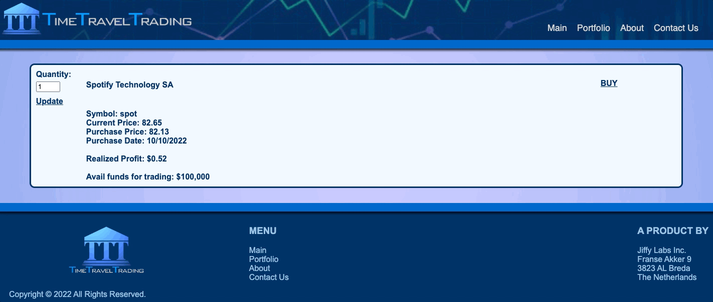

<!-- PROJECT LOGO -->
 

  

<h1 align="center">Time Travel Trading</h1>

<!-- ABOUT THE PROJECT -->
## About The Project

<h3> Project Criteria</h3>
<ul>
<li>Lightweight application for creating and updating a single object and listing all objects.</li>
<li>Utilize a Spring Boot</li>
<li>Have at least four (4) API endpoints</li>
<li>Store data in DynamoDB using the CRUD Repository interface</li>
<li>Implement a basic front-end</li>
<li>Contain 70% code coverage testing of service classes</li>
<li>Run integration tests for the primary use case</li>
</ul>

<!-- FEATURES -->

<h3>Roadmap</h3>
<ul>
<li>Search & display stock options from dow jones, nasdaq, and S&P 500 (external API)</li>
<li>Select & view stock for more information, including realized gain</li>
 

 
 
<li>Purchase stock and view portfolio</li>
 

 
 
<li>Contact Us page/form</li>
 

 
 
<li>Responsive web design</li>
 

</ul>

<!-- CONTRIBUTORS -->
<h2>Contributors</h2>
<h4>Nichole Davidson - Scott Zastrow - AJ Bennett</h4>

